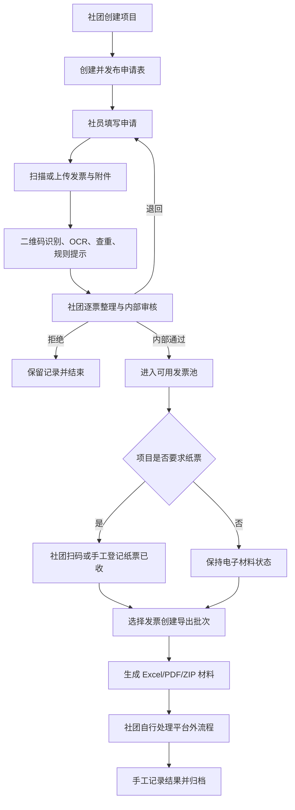
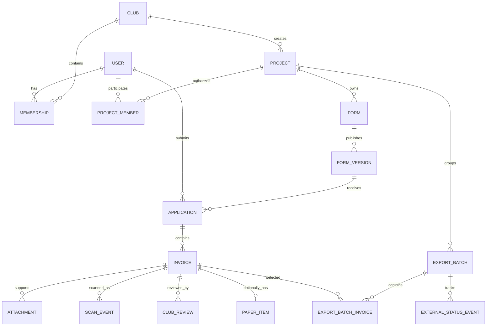

# 社团发票收集与管理辅助工具 PRD（v3.0）

> 文档类型：面向产品、设计、开发和测试的实施版 PRD
> 文档状态：开发基线稿
> 更新时间：2026-08-01
> 业务层级：社员—社团
> 产品名称：票聚山大 / Invoice Hub

## 1. 产品摘要

本产品是社团内部使用的发票收集与管理辅助工具。

系统帮助社团创建项目和申请表，统一收集社员发票及相关材料，完成二维码识别、OCR、查重、分类、内部审核、纸票收取、台账查询和材料导出。

主流程：

`社团创建项目 → 发布申请表 → 社员提交发票 → 系统识别与预检 → 社团整理/退回/内部通过 → 形成发票台账或导出批次 → 社团自行处理平台外流程`

平台不连接任何外部审批或正式财务流程。“社团内部通过”不能被解释为发票已符合学校报销要求。

## 2. 产品定位与价值

本产品是社团内部的发票收集与管理工具，不是学校报销系统。

平台中的“审核通过”统一展示为“社团内部通过”，仅代表社团确认材料可以进入下一步整理或外部处理，不代表任何外部单位、学校财务或税务机关认可。

产品价值集中在三个方面：

1. **统一收集**：让社员按同一表单提交，避免发票散落在群聊和私聊；
2. **高效整理**：自动识别、查重、汇总金额，减少手工录表；
3. **持续管理**：按项目、人员、状态和时间查询发票，换届后仍能追溯。

## 3. 目标与非目标

### 3.1 MVP 目标

1. 社团可在不依赖外部单位的情况下独立使用；
2. 社员可通过移动端在两分钟内完成一张普通发票提交；
3. 社团可在一个工作台查看项目全部申请和发票；
4. 系统自动提取常见字段、发现明显重复并汇总金额；
5. 社团可逐票退回、拒绝或内部通过；
6. 需要纸票的项目可跟踪社团是否已收到；
7. 社团可生成结构化台账和附件材料包；
8. 换届后历史数据和处理记录仍可查询。

### 3.2 非目标

MVP 不提供：

- 对学校、社团指导单位、指导老师的审批功能；
- 对发票是否最终可报销的保证；
- 学校财务系统接口；
- 自动发票验真；
- 预约单生成、金额对账；
- 付款、银行卡或会计记账；
- 跨社团统一审批；
- 平台管理纸票移交外部后的实际责任链。

## 4. 目标用户与权限

### 4.1 目标用户

**社员**

- 查看可参与的项目；
- 填写项目申请表；
- 扫描或上传发票；
- 补充支付记录、订单明细等材料；
- 查看社团审核结果；
- 按要求补充材料或提交纸票。

**项目负责人**

- 创建和维护项目；
- 创建申请表并发布；
- 查看收集进度；
- 整理、分类和催收社员提交；
- 跟踪项目整体发票金额和状态。

**社团审核人/财务负责人**

- 查看社团项目和发票台账；
- 逐张审核发票和附件；
- 退回、拒绝或内部通过；
- 建立标签、费用分类和备注；
- 选择发票形成导出批次；
- 记录纸票收取和平台外处理结果。

**社团管理员**

- 管理社团成员和角色；
- 设置项目负责人和审核人；
- 配置表单模板、费用类别和提示规则；
- 完成换届交接；
- 查看社团汇总数据和审计记录。

### 4.2 角色

| 角色 | 职责 |
|---|---|
| 社员 | 提交本人申请、发票和附件，处理退回，查看本人状态 |
| 项目负责人 | 创建项目和申请表，查看收集进度，整理项目数据 |
| 社团审核人 | 逐票审核、退回、拒绝、内部通过、创建导出批次 |
| 社团管理员 | 管理成员、角色、项目、规则、模板、导出和换届交接 |
| 平台管理员 | 维护系统配置，不默认查看所有社团发票正文 |
| 审计只读用户 | 在社团授权范围内查看历史记录，不可修改 |

一个用户可以在不同社团拥有不同角色。

### 4.3 权限矩阵

| 操作 | 社员 | 项目负责人 | 社团审核人 | 社团管理员 | 审计只读用户 |
|---|:---:|:---:|:---:|:---:|:---:|
| 查看项目 | 授权范围 | 负责项目 | 授权项目 | 本社团全部 | — |
| 创建项目 | — | ✓ | — | ✓ | — |
| 创建/发布申请表 | — | ✓ | — | ✓ | — |
| 创建本人申请 | ✓ | ✓ | ✓ | ✓ | — |
| 修改社员原始答案 | 仅本人且状态允许 | — | — | — | — |
| 添加社团整理字段 | — | ✓ | ✓ | ✓ | — |
| 作出内部审核结论 | — | 兼任审核人时 ✓ | ✓ | ✓ | — |
| 标记纸票已收 | 仅确认本人交票 | ✓ | ✓ | ✓ | — |
| 创建导出批次 | — | 兼任审核人时 ✓ | ✓ | ✓ | — |
| 管理成员与角色 | — | — | — | ✓ | — |
| 查看本社团审计日志 | — | — | — | ✓ | ✓ |

MVP 不设社团级权限配置，以上“兼任审核人时”指用户同时拥有社团审核人角色。权限必须由服务端根据用户、社团、项目和资源归属共同校验。

权限基本原则：

- 社员只查看和修改本人申请；
- 项目负责人只管理被授权项目；
- 社团审核人查看社团授权范围内的申请和发票；
- 社团管理员管理本社团成员、角色和全部项目；
- 不同社团数据严格隔离；
- 平台管理员不默认查看所有发票正文；
- 权限在服务端校验，不能仅依赖页面隐藏；
- 用户离任后权限失效，历史操作署名保留。

## 5. 术语

| 术语 | 定义 |
|---|---|
| 社团 | 独立管理项目、成员、申请和发票数据的组织空间 |
| 项目 | 一次活动、比赛、学期或其他发票收集主题 |
| 申请表 | 项目发布给社员填写的动态表单 |
| 表单版本 | 申请表每次发布时保存的不可变结构 |
| 社员申请 | 某社员基于指定表单版本提交的一次申请 |
| 发票 | 申请中的一张发票及其结构化字段和原始文件 |
| 佐证材料 | 支付记录、订单明细、活动说明等附件 |
| 社团整理字段 | 社团独立添加的费用分类、标签和内部备注 |
| 社团内部审核 | 社团对单张发票作出的内部通过、退回或拒绝结论 |
| 纸票状态 | 纸质原件或打印件是否已交给社团的可选记录 |
| 可用发票池 | 已经社团内部通过且尚未进入有效导出批次的发票集合 |
| 导出批次 | 社团选择一组发票后生成的材料集合，不代表外部报销提交 |
| 平台外状态 | 社团手工记录材料离开平台后的处理状态 |

## 6. 业务流程



### 6.1 发票二维码扫描流程

扫码发生在平台页面内，扫描的是发票自身二维码，平台不生成或打印批次二维码。

社员提交时：

1. 打开申请表中的发票组件；
2. 点击“扫描发票”；
3. 扫描发票自身二维码；
4. 系统提取可识别的票号、日期、金额等信息；
5. 社员确认字段并补充文件或照片；
6. 系统执行平台内查重。

社团收到纸票时：

1. 打开项目或导出批次的“纸票收取”页面；
2. 点击“开始扫码”；
3. 连续扫描纸票上的发票二维码；
4. 系统定位社员提交的线上记录并标记“社团已收”；
5. 扫到非本项目、重复或数据不一致的发票时提示异常。

二维码只用于快速录入和匹配，不直接代表发票真实有效。没有可识别二维码时，可以使用 OCR、票号搜索或人工选择。

## 7. 业务规则与不变量

以下规则由服务端强制执行。

### 7.1 数据所有权

1. 社员原始答案只允许本人在可编辑状态修改；
2. 项目负责人和审核人只能添加社团整理字段，不能静默修改社员原始答案；
3. 审核记录采用追加模式，历史结论不可覆盖；
4. 正式提交后的文件替换必须保留旧文件、原因和操作者；
5. 不同社团之间的数据、文件和导出严格隔离。

### 7.2 项目和表单

1. 每个项目只属于一个社团；
2. 一个项目可以有多个项目负责人；
3. 一个项目可以发布多个申请表；
4. 表单每次发布产生新版本；
5. 已有申请的表单版本不可修改或删除；
6. 社员申请必须绑定提交时的表单版本；
7. 项目归档后不能新增申请或导出批次。

### 7.3 申请与发票

1. 一条申请可以包含一张或多张发票；
2. 每张发票只属于一条申请；
3. 发票审核粒度为单张发票；
4. 申请整体状态由其中发票状态派生；
5. 申请报销金额必须大于 0，默认不高于票面金额；
6. 所有金额使用定点小数，禁止浮点数计算；
7. 发票二维码识别成功不能自动产生内部通过结论；
8. OCR 和规则提示均需允许人工确认。

### 7.4 查重

1. 优先使用发票代码和号码、数电票号等稳定标识；
2. 辅助使用开票日期、金额、销售方、原文件哈希和图像指纹；
3. 同一张发票不能同时存在于两个未结束的导出批次；
4. 跨社团命中疑似重复时，仅显示“平台存在重复风险”，不泄露另一社团信息；
5. 作废或误报记录不能直接删除，应保留争议处理记录。

### 7.5 纸票

1. 纸票模块由项目配置是否启用；
2. 启用后，每张内部通过的发票具有纸票状态；
3. 纸票收取优先扫描发票自身二维码定位线上记录；
4. 无可识别二维码时可使用票号搜索或人工选择；
5. 平台记录社团收票人和时间；
6. 平台不声明或验证纸票离开社团后的实际持有人。

### 7.6 导出批次

1. 每个导出批次只属于一个项目；
2. 只能选择社团内部通过的发票；
3. 批次金额由服务端根据发票申请金额计算；
4. 批次生成后保存不可变快照；
5. 再次生成形成新版本，不覆盖旧导出；
6. 批次状态不等同于学校报销状态。

## 8. 功能需求与验收标准

优先级：P0 为 MVP 必须，P1 为试点后候选，P2 为未来扩展。

### AUTH-01 登录与账号（P0）

需求：

- 统一使用山东大学 OIDC 登录，学工号作为 CAS 唯一标识 `cas_id`；
- 平台管理员和社团管理员可预开通账号，首次登录时由 OIDC 确认身份并同步姓名；
- 支持批量导入姓名、学工号、社团和角色，导入只负责预开通账号，不生成平台密码；
- `password_setup_token` 等平台密码字段仅作未来兼容预留，当前阶段不开放密码登录或令牌接口；
- 支持账号禁用和离任。

验收标准：

- 同一学工号不能创建两个有效身份；
- `cas_id` 即学工号，作为用户表主键，创建后不允许修改；
- 禁用账号不能继续访问受保护资源；
- 未预开通、禁用或离任账号不能完成 OIDC 登录；
- 用户加入多个社团后能够切换当前社团；
- 切换社团不会显示另一社团未授权数据。

### ORG-01 社团与成员（P0）

需求：

- 创建、编辑、停用社团；
- 邀请或批量导入成员（MVP 邀请方式为管理员添加成员并下发一次性密码设置令牌，不提供公开邀请链接）；
- 设置角色和任期；
- 支持换届交接。

验收标准：

- 普通社员不能管理成员；
- 任期到期后对应角色自动失效；
- 停用社团禁止新增项目和申请；
- 历史项目和审核记录保留原操作人署名。

### PRJ-01 项目管理（P0）

需求：

- 创建项目：名称、说明、负责人、时间、可见范围；
- 可选填写预算、经费来源和费用类别；
- 配置是否要求纸票；
- 支持草稿、收集中、停止收集、整理中、已归档；
- 支持复制历史项目配置：复制仅包含项目配置，可选复制申请表（为草稿版本）和项目成员，不复制申请、发票和导出批次，新项目状态为草稿。

验收标准：

- 项目只能属于一个社团；
- 项目已有申请后不能硬删除；
- 非负责人不能修改项目；
- 项目归档后禁止新增提交。

### FORM-01 动态申请表（P0）

需求：

- 每个项目可创建多个申请表；
- 支持模板复制：可将已有申请表最新版本复制为本项目或其他项目（同社团）的新表单草稿；
- 字段类型：文本、多行文本、数字、金额、日期、单选、多选、人员、发票、附件、说明；
- 支持必填、帮助文字、条件显示、条件必填、数值范围和文件限制；
- 设置提交范围、开始时间、截止时间和每人提交次数；
- 发布时产生不可变版本；
- 支持暂停和结束收集。

验收标准：

- 已发布版本不能直接修改；
- 修改后必须发布新版本；
- 历史申请按原版本正确展示；
- 条件校验由前后端共同执行。

### APP-01 社员申请（P0）

需求：

- 社员查看有权限的申请表；
- 移动端填写、自动保存草稿并提交；
- 一条申请可添加多张发票；
- 查看社团处理状态和意见；
- 退回后修改指定内容并重新提交。

验收标准：

- 他人不能查看或修改本人申请；
- 正式提交后默认不能自行撤回；
- 截止后默认禁止新建申请；
- 退回修改保留前后差异；
- 再次提交不会生成重复申请记录。

### INV-01 发票上传与字段（P0）

需求：

- 支持 PDF、OFD、JPG、PNG；
- 保存原始文件并生成预览；
- 字段包括类型、代码、号码、日期、购买方、税号、销售方、票面金额、申请金额；
- 关联支付记录、订单明细和其他材料；
- 支持 OCR 和人工输入；
- 低置信度字段要求社员按“识别建议 ID + 来源任务 + 最终值”确认；
- 草稿发票可以删除；正式发票只能说明原因后作废，原始文件和历史保留。

验收标准：

- 原始文件哈希在生命周期内保持不变；
- 上传文件只有在恶意内容扫描进入 READY 后才能被业务对象引用；
- OCR 失败不阻断人工提交；
- 申请金额超过票面金额时按规则阻断或警告；
- 金额由服务端使用定点小数校验。

### INV-02 发票二维码扫描（P0）

需求：

- 在发票组件内调用摄像头扫描发票自身二维码；
- 解析可获得的票号、代码、日期、金额或其他标识；
- 使用解析结果预填字段并执行查重；
- 社团纸票收取页面支持连续扫码；
- 扫码结果包括成功、已扫描、非当前项目、疑似重复、数据不一致、格式不支持；
- 无法识别时提供 OCR、票号搜索和人工选择；
- 扫码结果不能自动覆盖已确认字段。

验收标准：

- 扫描后 2 秒内返回匹配或解析结果；
- 连续扫描同一发票不会重复增加实收数量；
- 扫描非当前项目发票时给出明确提示；
- 扫码不可用时完整流程仍可继续；
- 每次扫码记录操作者、上下文、结果和时间。

### INV-03 规则提示与查重（P0）

需求：

- 配置抬头、税号、必要附件、时间、金额和费用类别规则；
- 项目可绑定指定已发布规则集，未绑定时使用社团唯一默认规则集；
- 规则结果分为阻断、警告和提示；
- 平台内执行精确和疑似重复检查；
- 支持人工确认风险；
- 规则具有版本和生效时间。

验收标准：

- 精确重复不能进入内部通过状态；
- 跨社团重复提示不泄露另一社团详情；
- 规则更新不改变历史提交结果；
- 每个提示可展示规则编号和原因；
- 规则配置必须使用系统支持的强类型字段，不允许脚本或任意表达式；
- 精确重复默认只在社团范围内执行，无权查看的匹配不返回对象 ID。

### REV-01 社团整理与内部审核（P0）

需求：

- 按项目、申请表、社员、金额、风险和状态筛选；
- 同屏查看申请、发票、附件和规则提示；
- 添加费用类别、标签和内部备注；
- 对每张发票执行内部通过、退回或拒绝；
- 审核人先执行“开始审核”，再作出通过、退回或拒绝结论；
- 支持批量处理低风险发票；批量处理对“已提交”状态发票隐式执行“开始审核”，逐票记录，无需先逐票开始审核；
- 退回原因使用字典和补充文字；
- 显示项目处理进度和金额汇总。

验收标准：

- 审核人不能修改社员原始答案；
- 每张发票具有独立结论；
- 退回时必须填写原因；
- 退回时必须至少指定一个稳定字段路径，社员只能修改这些字段；
- 拒绝发票不能进入可用发票池；
- 批量操作产生逐票审核记录。

### PAPER-01 社团纸票收取（P0）

需求：

- 项目启用纸票后显示待交、已收和异常；
- 发票进入社团内部通过时系统自动建立纸票记录（初始待交社团），社员声明已交只能作用于已存在的本人纸票记录；
- 人工修改纸票状态（退回社员、更正、归档）必须填写原因；
- 社员可以声明本人纸票已交，并在社团确认收取前撤销声明；
- 社团通过连续扫描发票二维码标记已收；
- 支持票号搜索和人工选择；
- 记录收票人和时间；
- 显示尚未交票的社员、张数和金额；
- 支持站内催交提醒。

验收标准：

- 未启用纸票的项目不显示强制纸票待办；
- 同一发票不能重复计数；
- 非当前项目发票不能被标记为已收；
- 人工修改纸票状态必须记录原因和操作者；
- 纸票写操作使用 PaperItem 版本锁，不能混用 Invoice 版本。

### LEDGER-01 发票台账（P0）

需求：

- 支持按社团、项目、表单、人员、日期、金额、类别、状态和标签筛选；
- 支持保存常用筛选；
- 展示票面金额、申请金额和项目合计；
- 支持查看单张发票完整时间线：MVP 由客户端聚合同一张发票的审核记录、纸票事件、扫码事件与预检历史形成时间线，不提供单独的时间线端点；
- 支持权限范围内导出列表。

验收标准：

- 合计金额由服务端按当前筛选计算；
- 分页和筛选不会造成金额重复计算；
- 社员只能看到本人数据；
- 导出不能绕过页面数据权限。

### EXPORT-01 导出批次（P0）

需求：

- 从同一项目可用发票池选择发票；
- 自动汇总发票张数、票面金额和申请金额；
- 保存不可变批次快照和版本；
- 生成 Excel、PDF 和 ZIP；
- 支持取消未归档批次；
- 记录平台外状态和备注。

导出结构：

```text
材料包-社团-项目-批次-日期/
├─ 00-批次封面与清单.pdf
├─ 01-发票明细.xlsx
├─ 02-社员申请信息.xlsx
├─ 03-原始电子发票/
├─ 04-支付记录/
├─ 05-订单与其他材料/
└─ manifest.json
```

验收标准：

- 不同项目发票不能进入同一批次；
- 同一发票不能进入两个未结束批次；
- 导出金额与批次快照一致；
- 再次导出不覆盖旧版本；
- `manifest.json` 包含文件路径和哈希；
- 生成任务成功后才能进入“已生成”，首次创建产物下载地址后进入“已导出”；
- 取消批次释放发票占用，完成批次归档不释放占用；
- 导出选择上限为 1000 张，审核和纸票批量操作上限为 100 张。

### EXT-01 平台外状态（P0）

需求：

- 默认状态：待外部处理、已提交外部、外部退回、已完成、已取消、已归档；
- 社团可配置状态显示名称；
- 记录状态时间、操作者、备注和附件；
- 平台明确提示状态为社团手工记录。

验收标准：

- 平台外状态不能自动改变社团内部审核结论；
- 已归档记录只能通过更正操作追加信息；
- 更正事件必须引用被更正事件并填写原因；
- 社员只看到与本人发票相关的外部状态；
- 所有变更写入审计日志。

### NTF-01 待办与通知（P0）

触发事件：

- 表单即将截止；
- 申请被退回；
- 发票待社团处理；
- 项目要求纸票但尚未交；
- 导出批次生成；
- 平台外状态变化；
- 角色或项目负责人变化。

验收标准：

- 点击通知进入用户有权访问的对象；
- 权限移除后旧通知不能成为越权入口；
- 定时任务重试不会无限生成重复通知。

### RULE-01 社团规则与字典（P0）

需求：

- 配置开票信息、费用类别、退回原因、标签和附件要求；
- 支持学校通用规则模板和社团附加规则；
- 社团可增加更严格提示；
- 规则版本可追溯；
- 同一社团最多一个已启用默认规则集，项目可以显式覆盖。

验收标准：

- 社团不能修改其他社团规则；
- 规则修改不重写历史结果；
- 表单和审核页面使用同一版本字典；
- 规则发布后不可原地改写，修改形成新版本。

### AUDIT-01 审计与换届交接（P0）

记录：

- 登录和权限变化；
- 项目、表单和规则变化；
- 申请提交和修改；
- 文件上传和替换；
- 扫码和纸票状态；
- 审核、退回和拒绝；
- 导出和平台外状态；
- 查看、下载和导出敏感数据。

换届：

- 新负责人继承组织数据权限；
- 历史操作人和审核结论不变；
- 未处理项目和批次进入交接清单；
- 离任人员角色失效；
- 交接由平台在单事务中迁移项目负责人和待处理授权、结束离任成员关系。

验收标准：

- 业务用户不能删除审计日志；
- 可按用户、项目、发票和批次查询时间线；
- 换届后新负责人可查看社团历史台账；
- 离任人员不能继续访问。

## 9. 状态机

状态迁移使用服务端白名单和乐观锁。完整迁移白名单以 API 契约为准。

### 9.1 项目

`草稿 → 收集中 → 停止收集 → 整理中 → 已归档`

除线性主链外，服务端还允许停止收集后恢复收集（COLLECTION_STOPPED→COLLECTING）、整理中退回停止收集、草稿/收集中直接归档。

### 9.2 申请

`草稿 → 已提交 → 社团处理中 → 已退回 / 部分通过 / 全部通过 / 已拒绝 → 已完成`

申请状态由其发票状态派生。

派生优先级：尚未提交为草稿；全部发票为已提交时申请为已提交；存在退回发票时为已退回；存在已开始审核或仍未结论发票时为社团处理中；通过与拒绝/作废并存为部分通过；全部非作废发票通过或进入有效导出批次为全部通过；全部发票拒绝或作废为已拒绝；全部发票归档且无待处理事件为已完成。

申请重新提交时退回发票自动回到已提交并重新预检；项目归档时拒绝与作废发票一并归档，因此已拒绝申请可随项目归档到达已完成。

### 9.3 发票

`草稿 → 待二维码/OCR确认 → 已提交 → 已开始审核 → 退回补充 / 社团内部通过 / 社团拒绝`

三种审核结论中仅“社团内部通过”可继续前进至已加入导出批次、已归档；退回补充在申请重新提交时回到已提交；社团拒绝与作废发票随项目归档而归档（历史结论保留）。草稿使用删除操作；任意正式发票可显式作废，作废不删除历史。

### 9.4 纸票

`不要求 / 待交社团 →（可选：社员声明已交）→ 社团已收 → 已退回社员 / 已由社团移交外部 / 已归档`

“社员声明已交”为可选中间态，社团可直接从待交社团收取。“已由社团移交外部”仅为社团手工记录，平台不追踪外部持有人。

### 9.5 导出批次

`草稿 → 已生成 → 已导出 → 外部处理中 → 已完成 / 已取消 → 已归档`

“已生成”由生成任务成功产生，“已导出”由首次获取产物下载地址产生；客户端不能直接伪造这两个状态。

## 10. 数据模型

### 10.1 实体关系



### 10.2 核心字段

| 实体 | 关键字段 |
|---|---|
| User | cas_id（主键，即学工号）、name、password_hash、status、version |
| Club | id、name、type、status |
| Membership | cas_id、club_id、role、term_start、term_end、status |
| Project | id、club_id、name、paper_required、rule_set_id、status、version |
| ProjectMember | project_id、cas_id、role |
| Form | id、project_id、name、status |
| FormVersion | form_id、version_no、schema_json、published_at |
| Application | id、form_version_id、applicant_cas_id、answers_json、status、version |
| Invoice | id、application_id、type、code、number、date、buyer、tax_no、seller、face_amount、claimed_amount、file_id、hash、organization_fields（社团整理字段：费用类别、标签、内部备注）、status、version |
| Attachment | id、invoice_id、type、file_id、hash |
| ScanEvent | invoice_id、project_id、actor_cas_id、context、raw_hash、parsed_identity_json、result、created_at |
| ClubReview | invoice_id、reviewer_cas_id、action、reason_code、return_fields、comment、created_at |
| RecognitionSuggestion | id、invoice_id、source_job_id、field、value、confidence、created_at |
| PaperItem | invoice_id、status、received_by_cas_id、received_at、note、version |
| ExportBatch | id、project_id、batch_no、revision_no、status、snapshot_json、invoice_reservation_active、version |
| ExportBatchInvoice | batch_id、invoice_id、snapshot_amount、sequence_no |
| ExternalStatusEvent | batch_id、actor_cas_id、event_type、status、correction_of_event_id、comment、file_id、created_at |
| HandoverRecord | club_id、outgoing_membership_id、incoming_membership_id、snapshot_json、created_at |
| AuditLog | actor_cas_id、action、object_type、object_id、before_digest、after_digest、request_id、created_at |

RuleSet、DictionaryItem、Notification、SavedInvoiceFilter、Job、FileObject、ExportArtifact 等支撑实体的字段以 API 契约与 OpenAPI 定义为准。

### 10.3 开发约束

- `User` 使用不可修改的 `cas_id` 作为主键，`cas_id` 即学工号；其他需要独立 ID 的业务实体使用不可预测的全局唯一标识；
- 关联用户的外键统一命名为 `*_cas_id` 或 `cas_id`，并引用 `User(cas_id)`；
- 金额使用 `DECIMAL(12,2)` 或等价定点类型；
- 时间统一存储 UTC，界面按 Asia/Shanghai 显示；
- 关键业务表包含版本字段用于乐观锁；
- 所有会改变服务端状态的接口（含登录/刷新会话、创建、状态迁移、更新和删除）支持幂等键；需要乐观锁的操作同时校验 `If-Match`；
- 每个 HTTP 操作接受并回传 `X-Request-Id`，未枚举错误使用统一 Problem Details；
- 原始文件只读保存，预览文件单独生成；
- 二维码原始内容非必要时不长期明文保存；
- 正式提交后的业务数据软删除或作废，不物理删除；
- 文件 READY 前不能被业务对象引用，孤立文件按保留期限清理；
- 通知保存资源目标而不是任意 URL；
- 状态、权限和金额由服务端重新校验；
- 所有导出通过异步任务生成。

## 11. 页面与交互

### 11.1 社员端（移动优先）

1. 我的社团；
2. 可参与项目；
3. 项目申请表；
4. 发票二维码扫描；
5. 文件上传和 OCR 确认；
6. 我的申请；
7. 退回处理；
8. 纸票待交提醒；
9. 本人平台外状态。

### 11.2 社团端（桌面优先）

1. 社团工作台；
2. 项目管理；
3. 申请表设计器；
4. 申请与发票审核工作台；
5. 发票台账；
6. 纸票连续扫码收取；
7. 可用发票池；
8. 导出批次；
9. 平台外状态；
10. 规则、成员和换届交接；
11. 审计日志和统计。

### 11.3 审核工作台布局

- 左侧：发票列表、筛选和状态；
- 中间：发票预览及结构化字段；
- 右侧：社员用途、附件、规则提示和社团整理字段；
- 顶部：项目张数、待处理数和金额汇总；
- 底部：内部通过、退回、拒绝、上一张、下一张。

### 11.4 纸票扫码页面

- 显示项目名称和待收清单；
- 连续调用摄像头扫描发票自身二维码；
- 成功后自动准备下一次扫描；
- 展示已收/应收张数和金额；
- 明确提示重复、非本项目和数据不一致；
- 提供票号搜索和人工选择入口。

## 12. 异常和边界场景

| 场景 | MVP 处理 |
|---|---|
| 发票二维码无法识别 | 使用 OCR、票号搜索或人工录入 |
| 扫描到其他项目发票 | 提示非当前项目，不改变数据 |
| OCR 服务不可用 | 允许人工录入并标记来源 |
| 社员重复提交同一发票 | 阻断内部通过，交社团人工判断 |
| 社员未交纸票 | 保持待交状态，可催交，不影响无需纸票的其他发票 |
| 审核人发现字段错误 | 退回社员，不能静默修改 |
| 发票已进入导出批次后被修改 | 原批次保留快照，新内容需新批次版本 |
| 项目负责人离任 | 通过换届交接转移未处理项目权限 |
| 外部退回发票 | 社团手工记录，并按需重新打开内部处理 |
| 用户同时编辑同一对象 | 乐观锁冲突，提示刷新后重试 |

## 13. 安全与隐私

- MVP 不收集银行卡号；
- 仅收集完成社团内部管理所需的信息；
- 文件默认私有，使用短时授权地址；
- 防止通过 URL、对象 ID 或请求参数跨社团访问；
- 平台管理员不默认拥有全部发票正文权限；
- 查看、下载和导出敏感数据写入日志；
- 数据库、文件和备份加密；
- 上传文件进行类型、大小和恶意内容检查；
- 上传文件按社团/项目范围绑定，READY 前不可关联；
- 发票二维码解析结果按最小必要原则保存；
- 正式提交后的原始材料和审核记录不可静默删除；
- 导出文件按社团权限控制并设置有效期；
- 通知只保存受限资源目标，由客户端可信路由表生成站内地址；
- 审计变更摘要不保存密码、令牌、二维码原文或完整文件内容。

## 14. 非功能需求

### 14.1 性能

- 普通列表和详情接口 P95 小于 2 秒；
- 发票二维码扫描后 P95 在 2 秒内返回匹配结果；
- OCR 异步处理，P95 在 60 秒内返回结果或失败状态；
- 单文件默认上限 30 MB；
- 支持至少 200 个社团、10,000 名用户、每年 100,000 张发票；
- 试点并发用户目标 200。

### 14.2 可用性

- 月可用性目标 99.5%；
- 数据库 RPO 不高于 24 小时，RTO 不高于 4 小时；
- OCR、扫码或通知不可用时，人工流程仍可继续；
- 异步任务可重试并保证幂等。

### 14.3 兼容性与可访问性

- 支持主流 Chrome、Edge、Safari 移动浏览器；
- 社员申请和扫码适配手机；
- 社团工作台适配 1366×768 及以上桌面；
- 状态和错误不只依赖颜色；
- 核心审核支持键盘操作；
- 发票图片支持放大、旋转和全屏；
- 相机权限被拒绝时显示手工入口。

## 15. 数据统计与成功指标

### 15.1 统计口径

MVP 提供：

- 每个项目申请数、发票数和申请金额；
- 待处理、通过、退回和拒绝数量；
- 常见退回原因；
- 发票二维码识别成功率；
- OCR 人工修正率；
- 疑似重复发票数量（“相同票号”指发票代码与号码组合或数电票号）；
- 纸票要求数量和已收比例；
- 项目处理时长；
- 导出批次数量和金额；
- 平台外状态分布。

各项统计口径（如二维码识别成功率、OCR 人工修正率）在试点阶段以项目统计与社团仪表盘接口为准，详细口径随试点确认。

### 15.2 成功指标

| 指标 | 试点目标 |
|---|---:|
| 社员首次提交材料完整率 | ≥ 85% |
| 社团整理一张发票的平均耗时 | 相比现状降低 40% |
| 平台内重复发票识别率 | 对相同票号或相同原文件达到 100% |
| 已要求纸票的实收状态可追踪率 | 100% |
| 项目发票金额自动汇总覆盖率 | 100% |
| 历史项目换届后可查询率 | 100% |

## 16. 交付范围

### 16.1 P0（MVP 必须）

1. 登录、社团、成员和角色；
2. 项目管理；
3. 动态申请表和版本；
4. 社员移动端申请；
5. 发票二维码扫描；
6. 发票上传、OCR 和人工确认；
7. 规则提示和查重；
8. 社团整理与逐票内部审核；
9. 发票台账；
10. 可选纸票收取；
11. 导出批次及材料包；
12. 平台外状态；
13. 待办通知；
14. 审计和换届交接。

### 16.2 P1（试点后候选）

- 山东大学统一身份认证；
- 微信、邮件或校内消息；
- 正规发票验真接口；
- 项目预算与实际金额对比；
- 更丰富的二维码格式适配；
- 自定义统计报表；
- 表单模板市场；
- 批量导入历史发票台账。

### 16.3 P2（未来扩展）

- 经学校批准的财务系统导入接口；
- 多级组织结构；
- 校级统一发票池；
- 电子档案归档；
- 更复杂的内部审批模板。

P2 仅作为技术预留，不属于当前产品承诺。

## 17. 开发里程碑

| 阶段 | 周期 | 交付 |
|---|---:|---|
| M0 业务确认与原型 | 2 周 | 流程、字段、二维码样本、关键页面原型、试点社团 |
| M1 基础域 | 2 周 | 账号、社团、成员、项目和权限 |
| M2 收集域 | 2 周 | 表单、申请、发票上传、二维码和 OCR |
| M3 整理域 | 2 周 | 规则、查重、社团审核、台账和纸票收取 |
| M4 输出域 | 2 周 | 导出批次、平台外状态、通知、日志和统计 |
| M5 试点验收 | 2 周 | 数据迁移、性能安全测试、真实项目回放、上线 |

建议总周期：10 至 12 周。

## 18. 端到端验收场景

测试数据：一个社团、一个项目、两名社员、三张发票、一名项目负责人、一名审核人。

1. 管理员创建社团并导入成员；
2. 项目负责人创建项目并启用纸票；
3. 创建申请表并发布；
4. 社员甲扫描二维码提交两张发票；
5. 社员乙上传一张无法扫码的发票并通过 OCR 确认；
6. 系统发现其中一张疑似重复并提示；
7. 审核人通过一张、退回一张、拒绝重复票；
8. 社员修改后重新提交，审核人内部通过；
9. 社团在纸票页面扫描两张发票，系统标记已收；
10. 审核人选择两张内部通过发票创建导出批次；
11. 系统生成 Excel、PDF、附件目录和清单文件；
12. 社团将批次标记为“已提交外部”；
13. 后续标记“已完成”并归档；
14. 新任负责人完成换届后仍可查看该项目；
15. 另一个社团用户访问项目、文件和导出均被拒绝。

全部步骤通过，视为 MVP 主链路验收通过。

## 19. 默认值与开发基线

| 决策项 | MVP 默认值 |
|---|---|
| 一条申请可包含几张发票 | 允许多张 |
| 项目负责人数量 | 允许多人 |
| 社团审核粒度 | 单张发票 |
| 纸票要求 | 项目级开关，默认关闭 |
| 发票二维码 | 优先使用，识别失败可降级 |
| 自动验真 | 不提供，仅支持人工记录 |
| 项目预算 | 可选，不阻断收集 |
| 导出批次部分修改 | 生成新版本，不覆盖旧快照 |
| 平台外状态 | 社团手工记录，不作真实性保证 |
| 统一身份认证 | 试点及生产统一使用山东大学 OIDC |

开发基线直接采用以下配置，不再阻塞接口和页面开发：

- 默认申请表：费用用途、费用类别、发票列表、支付记录、订单明细、其他说明；
- 初始费用类别：物资、交通、宣传制作、场地、餐饮、其他；
- 初始退回原因：抬头错误、税号错误、金额不一致、缺少支付记录、缺少订单明细、疑似重复、发票不清晰、超出时间范围、其他；
- 纸票功能默认关闭，由项目显式开启；
- 台账默认列：申请人、项目、票号、日期、销售方、票面金额、申请金额、费用类别、审核状态、纸票状态；
- 导出默认生成 XLSX、清单 PDF、附件 ZIP 和带 SHA-256 的 `manifest.json`；
- 二维码和 OCR 适配以脱敏测试语料作为上线门槛，不阻塞使用人工录入完成开发。

## 20. 上线前验收清单

- 收集 20—30 张真实脱敏发票测试二维码和 OCR；
- 确认社团常用申请表字段；
- 确认费用类别和退回原因字典；
- 确认纸票模块是否真的有使用需求；
- 确认导出 Excel 字段和附件目录；
- 使用一个历史项目完整回放；
- 比较现有 Excel/群聊流程与平台流程耗时；
- 完成跨社团越权和文件访问测试；
- 完成换届交接演练；
- 完成备份恢复测试；
- 由试点社团负责人确认验收结果。

---

本 PRD 只承诺社团内部效率提升。所有涉及外部单位审批或正式报销结果的能力均不属于本产品范围。
